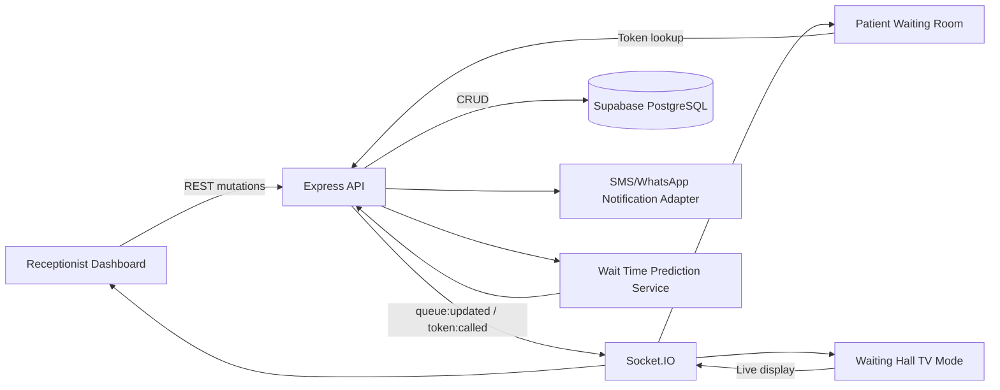

# Queue Cure 26 Smart Clinic Platform

## Architecture Diagram

## Database Updates

- `doctors`: doctor profile, specialty, room, availability.
- `patients`: `doctor_id`, `priority`, `phone_number`, `tracking_url`.
- `appointments`: booked appointments by doctor and scheduled time.
- `audit_logs`: token history, queue actions, notifications, appointments.

## API Surface

- Queue: `GET /api/queue`, `POST /api/queue/sync`, `POST /api/queue/call-next`
- Tracking: `GET /api/patients/token/:tokenNumber`, `GET /api/queue/patient/:tokenNumber`
- Analytics: `GET /api/queue/analytics`
- Doctors: `GET /api/queue/doctors`, `PATCH /api/queue/doctors/:doctorId`
- Pause/resume: `POST /api/queue/doctors/:doctorId/pause`, `POST /api/queue/doctors/:doctorId/resume`
- Appointments: `GET /api/queue/appointments`, `POST /api/queue/appointments`
- Audit: `GET /api/queue/audit-logs`
- Notifications: `POST /api/queue/notifications`

## Socket.IO Events

- `queue:state`
- `queue:updated`
- `patient:added`
- `token:called`
- `settings:updated`
- `doctor:updated`
- `queue:paused`
- `queue:resumed`
- `appointment:created`
- `notification:queued`
- `voice:announcement`

## UI Components Added

- `TokenQRCode`
- `DoctorStatusPanel`
- `AnalyticsCharts`
- `QueueTimeline`
- `VoiceAnnouncer`
- `AppointmentBooking`
- TV route: `/tv`

## Future Enhancements

- Swap the QR image provider for a self-hosted encoder package before regulated production rollout.
- Add role-based authentication for receptionists, doctors, and administrators.
- Integrate Twilio, WhatsApp Cloud API, or a regional SMS provider behind the notification adapter.
- Train wait-time prediction from historical consultation durations.
- Add per-doctor rooms, departments, and multi-location clinic support.
- Add offline-first kiosk mode for reception counters.
- Add audit export and compliance retention policies.
